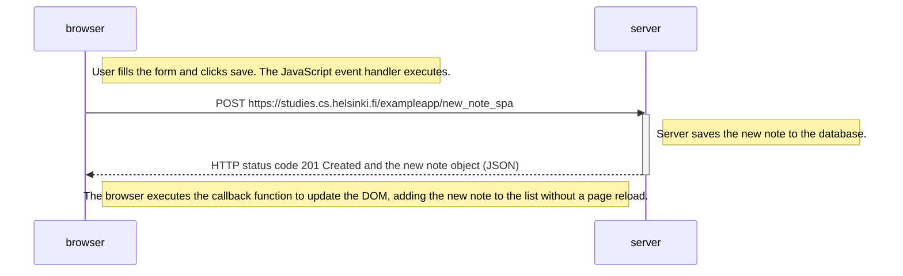

```mermaid
sequenceDiagram
    participant browser
    participant server

    Note right of browser: User fills the form and clicks save. The JavaScript event handler executes.

    browser->>server: POST https://studies.cs.helsinki.fi/exampleapp/new_note_spa
    activate server
    Note right of server: Server saves the new note to the database.
    server-->>browser: HTTP status code 201 Created and the new note object (JSON)
    deactivate server

    Note right of browser: The browser executes the callback function to update the DOM, adding the new note to the list without a page reload.
```